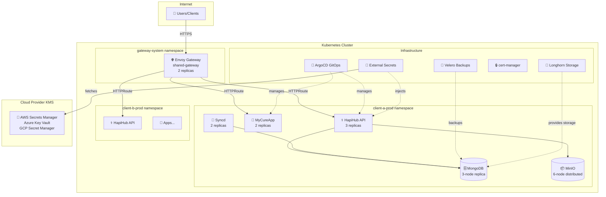
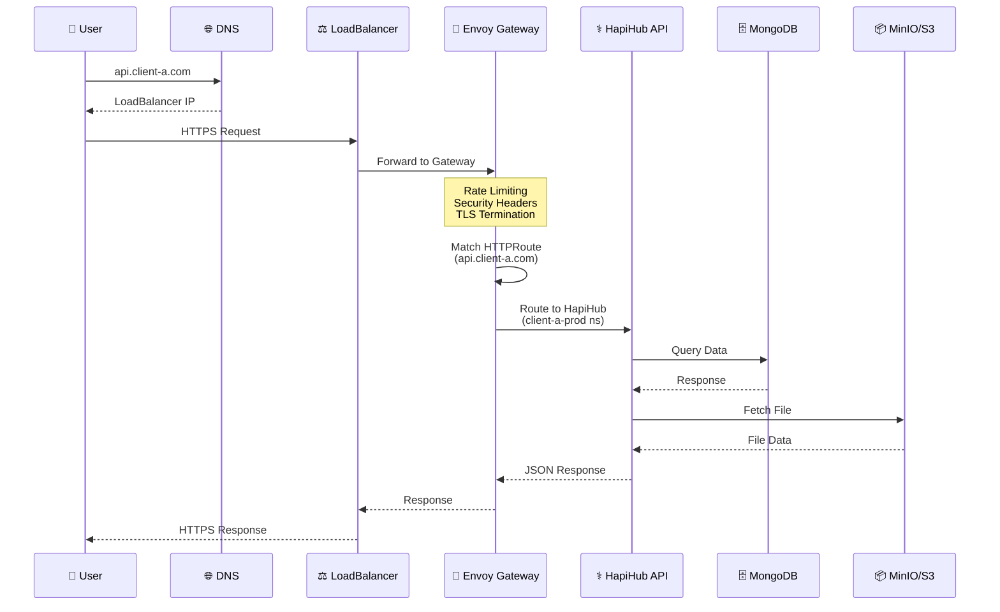
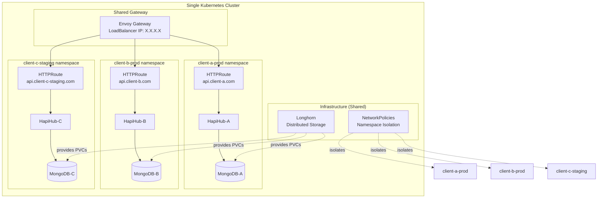

# Architecture Documentation

Technical architecture of the Monobase Infrastructure template.

## Table of Contents

1. [Overview](#overview)
2. [System Architecture](#system-architecture)
3. [Gateway Architecture](#gateway-architecture)
4. [Storage Architecture](#storage-architecture)
5. [Security Architecture](#security-architecture)
6. [Backup Architecture](#backup-architecture)
7. [Monitoring Architecture](#monitoring-architecture)

---

## Overview

### Design Principles

1. **No Overengineering** - Simple, proven technologies for <500 users
2. **Security by Default** - Zero-trust, encryption everywhere
3. **Fork-Based Workflow** - Reusable template, client-specific configuration
4. **Cloud-Native** - Kubernetes-native, CNCF projects preferred
5. **Cost-Effective** - Shared infrastructure, optional components

### High-Level System Architecture



### Technology Stack

**Core (Always Deployed):**
- Kubernetes 1.27+ (EKS, AKS, GKE, or self-hosted)
- Envoy Gateway (Gateway API)
- Longhorn (distributed storage)
- ArgoCD (GitOps)
- External Secrets Operator (KMS integration)
- cert-manager (TLS automation)

**Applications:**
- HapiHub (API backend)
- MyCureApp (Vue.js frontend)
- MongoDB 7.x (primary database)

**Optional:**
- Syncd (real-time sync)
- MinIO (self-hosted S3)
- Typesense (search engine)
- Velero (Kubernetes backups)
- Prometheus + Grafana (monitoring)

**NOT Included (Deliberately):**
- ❌ Service Mesh (Istio/Linkerd) - Overkill for 3 services
- ❌ Self-hosted Vault - Use cloud KMS instead
- ❌ Rook-Ceph - Longhorn + MinIO simpler

---

## System Architecture

### Request Flow Diagram



### Multi-Tenant Architecture



### Component Diagram

```
                    Internet / DNS
                          |
                   [LoadBalancer IP]
                          |
        ┌─────────────────┴─────────────────┐
        │    gateway-system namespace       │
        │  ┌──────────────────────────────┐ │
        │  │   Shared Envoy Gateway       │ │
        │  │   - HTTPS listener (443)     │ │
        │  │   - HA: 2 replicas           │ │
        │  │   - Rate limiting            │ │
        │  │   - Security headers         │ │
        │  └──────────────────────────────┘ │
        └────────────────┬──────────────────┘
                         │
        ┌────────────────┴──────────────────┐
        │   myclient-prod namespace         │
        │                                   │
        │  ┌────────────────────────────┐  │
        │  │ HTTPRoutes (per service)   │  │
        │  │ - api.myclient.com         │  │
        │  │ - app.myclient.com         │  │
        │  │ - sync.myclient.com        │  │
        │  └─────┬──────────────────────┘  │
        │        │                          │
        │  ┌─────┴──────┬────────┬────────┐│
        │  │            │        │        ││
        │ ┌▼──────┐ ┌──▼────┐ ┌▼──────┐ ││
        │ │HapiHub│ │ Syncd │ │MyCure │ ││
        │ │ App   │ │       │ │ App   │ ││
        │ │2-3 rep│ │2 rep  │ │2 rep  │ ││
        │ └───┬───┘ └───┬───┘ └───────┘ ││
        │     │         │                ││
        │  ┌──┴─────────┴──┐             ││
        │  │               │             ││
        │ ┌▼────────────┐ ┌▼─────────┐  ││
        │ │  MongoDB    │ │  MinIO   │  ││
        │ │  Replica Set│ │ Distrib. │  ││
        │ │  3 nodes    │ │ 6 nodes  │  ││
        │ └──────┬──────┘ └────┬─────┘  ││
        │        │             │         ││
        │  ┌─────┴─────────────┴──────┐ ││
        │  │   Longhorn Storage       │ ││
        │  │   - 3x replication       │ ││
        │  │   - Snapshots            │ ││
        │  │   - Encryption           │ ││
        │  └──────────────────────────┘ ││
        └────────────────────────────────┘
```

### Data Flow

**1. User Request → HapiHub API:**
```
Browser → DNS → LoadBalancer → Gateway (443) 
  → HTTPRoute (api.myclient.com) → HapiHub Service (7500) 
  → HapiHub Pod → MongoDB (27017)
```

**2. User Request → Frontend:**
```
Browser → DNS → LoadBalancer → Gateway (443)
  → HTTPRoute (app.myclient.com) → MyCureApp Service (80)
  → MyCureApp Pod (nginx serving static files)
```

**3. File Upload Flow:**
```
Client → HapiHub API → MinIO S3 API (9000)
  → Longhorn PVC → Distributed storage across nodes
```

**4. File Download Flow:**
```
Client → HapiHub (generates presigned URL)
  → Client downloads directly from MinIO via Gateway
  → HTTPRoute (storage.myclient.com) → MinIO (9000)
```

---

## Gateway Architecture

### Shared Gateway Strategy

**Key Decision: 1 Gateway + Dynamic HTTPRoutes**

```
┌─────────────────────────────────────┐
│  gateway-system namespace (shared) │
│                                     │
│  ┌───────────────────────────────┐ │
│  │   Shared Gateway              │ │
│  │   - Single HTTPS listener     │ │
│  │   - Wildcard: *.myclient.com  │ │
│  │   - HA: 2 Envoy replicas      │ │
│  │   - Single LoadBalancer IP    │ │
│  └───────────────────────────────┘ │
└──────────────┬──────────────────────┘
               │ References
    ┌──────────┼──────────┐
    │          │          │
┌───▼────┐ ┌──▼─────┐ ┌─▼──────┐
│Client A│ │Client B│ │Client C│
│HTTPRtes│ │HTTPRtes│ │HTTPRtes│
└────────┘ └────────┘ └────────┘
```

**Benefits:**
- ✅ **Zero-downtime client onboarding** - HTTPRoutes added dynamically
- ✅ **Single LoadBalancer IP** - Cost-effective
- ✅ **Independent routing** - Each client controls their routes
- ✅ **Flexible hostnames** - Any domain per service

**HTTPRoute Pattern:**
```yaml
apiVersion: gateway.networking.k8s.io/v1
kind: HTTPRoute
spec:
  parentRefs:
    - name: shared-gateway  # References shared Gateway
      namespace: gateway-system
  hostnames:
    - api.client.com       # Client-specific domain
  rules:
    - backendRefs:
        - name: hapihub
          port: 7500
```

---

## Storage Architecture

### Longhorn Distributed Block Storage

```
┌─────────────────────────────────────────┐
│         Longhorn Storage Cluster        │
│                                         │
│  ┌────────┐  ┌────────┐  ┌────────┐   │
│  │ Node 1 │  │ Node 2 │  │ Node 3 │   │
│  │        │  │        │  │        │   │
│  │ Replica│  │ Replica│  │ Replica│   │
│  │   A    │  │   A    │  │   A    │   │
│  │ Replica│  │ Replica│  │ Replica│   │
│  │   B    │  │   B    │  │   B    │   │
│  └────────┘  └────────┘  └────────┘   │
│                                         │
│  Data replicated 3x across nodes       │
│  Can lose 2 nodes without data loss    │
└─────────────────────────────────────────┘
         ▲
         │ iSCSI / NVMe
         │
┌────────┴─────────┐
│  StatefulSets    │
│  - MongoDB       │
│  - MinIO         │
│  - Typesense     │
└──────────────────┘
```

**Features:**
- **3-way replication** - Data on 3 nodes
- **Automatic failover** - Rebuilds replicas on node failure
- **Snapshots** - Hourly local snapshots
- **Backups** - Daily S3 backups
- **Encryption** - dm-crypt volume encryption
- **Expansion** - Online volume resize

### MinIO Distributed Storage (Optional)

```
┌─────────────────────────────────────────┐
│     MinIO Erasure Coding (EC:2)         │
│                                          │
│  6 Nodes × 250Gi = 1.5TB raw            │
│  4 data + 2 parity = ~1TB usable (66%)  │
│                                          │
│  ┌──────┐ ┌──────┐ ┌──────┐            │
│  │Data 1│ │Data 2│ │Data 3│            │
│  │250Gi │ │250Gi │ │250Gi │            │
│  └──────┘ └──────┘ └──────┘            │
│  ┌──────┐ ┌──────┐ ┌──────┐            │
│  │Data 4│ │Parity│ │Parity│            │
│  │250Gi │ │ 1    │ │  2   │            │
│  └──────┘ └──────┘ └──────┘            │
│                                          │
│  Can lose 2 nodes without data loss     │
└──────────────────────────────────────────┘
```

**Why MinIO:**
- S3-compatible API
- No egress fees (self-hosted)
- <1TB data (cost-effective)
- Full control

**Why External S3:**
- >1TB data (scale better)
- Global CDN integration
- Managed service
- Built-in redundancy

---

## Security Architecture

### Zero-Trust Network Model

```
Default: DENY ALL
    ↓
┌─────────────────────────────────┐
│  All traffic blocked by default │
└─────────────────────────────────┘
    ↓
Explicit ALLOW rules:
    ↓
┌─────────────────────────────────┐
│ ✅ Gateway → Apps               │
│ ✅ Apps → MongoDB               │
│ ✅ Apps → Storage               │
│ ✅ Apps → Internet (HTTPS)      │
│ ❌ Cross-namespace (blocked)    │
│ ❌ Direct pod access (blocked)  │
└─────────────────────────────────┘
```

### Defense in Depth

**Layer 1: Network (NetworkPolicies)**
- Default deny all traffic
- Explicit allow rules only
- Cross-namespace isolation
- DNS and K8s API allowed

**Layer 2: Pod (Pod Security Standards)**
- Non-root containers
- No privilege escalation
- Drop ALL capabilities
- Read-only root filesystem
- seccomp profile enforced

**Layer 3: Application (RBAC)**
- Dedicated service accounts
- Least-privilege roles
- No default SA usage
- Namespace-scoped permissions

**Layer 4: Data (Encryption)**
- At rest: Longhorn + MongoDB encryption
- In transit: TLS everywhere (cert-manager)
- Backups: S3 + KMS encryption

**Layer 5: Access (External Secrets)**
- Secrets never in Git
- KMS integration (AWS/Azure/GCP)
- Automatic rotation
- Audit logging

---

## Backup Architecture

### 3-Tier Backup Strategy

```
┌─────────────────────────────────────────┐
│  Tier 1: Hourly Snapshots (Fast)        │
│  - Storage: Local (Longhorn nodes)      │
│  - Retention: 72 hours                  │
│  - Recovery: ~5 minutes                 │
│  - Use: Quick rollback, recent issues   │
└─────────────────────────────────────────┘
              ↓
┌─────────────────────────────────────────┐
│  Tier 2: Daily Backups (Medium)         │
│  - Storage: S3 (off-cluster)            │
│  - Retention: 30 days                   │
│  - Recovery: ~1 hour                    │
│  - Use: Last month recovery             │
└─────────────────────────────────────────┘
              ↓
┌─────────────────────────────────────────┐
│  Tier 3: Weekly Archive (Long-term)     │
│  - Storage: S3 Glacier (cold)           │
│  - Retention: 90+ days (HIPAA)          │
│  - Recovery: ~4 hours                   │
│  - Use: Compliance, disaster recovery   │
└─────────────────────────────────────────┘
```

**Backup Methods:**

1. **Longhorn Snapshots** - Volume-level, COW snapshots
2. **Velero Backups** - Kubernetes-native, application-aware
3. **MongoDB dumps** - Application-level (optional)

**Recovery Time Objectives (RTO):**
- Tier 1: 5 minutes
- Tier 2: 1 hour
- Tier 3: 4 hours

**Recovery Point Objectives (RPO):**
- Tier 1: 1 hour (max data loss)
- Tier 2: 24 hours
- Tier 3: 1 week

---

## Monitoring Architecture

### Optional Monitoring Stack

```
┌─────────────────────────────────────────┐
│           Applications                  │
│  HapiHub, Syncd, MyCureApp             │
│  /metrics endpoints                     │
└──────────────┬──────────────────────────┘
               │ scrape
        ┌──────▼────────┐
        │  Prometheus   │
        │  - 15d retain │
        │  - 50Gi PVC   │
        │  - HA: 2 rep  │
        └───┬───────┬───┘
            │       │
    ┌───────▼──┐ ┌─▼────────────┐
    │ Grafana  │ │ Alertmanager │
    │Dashboard │ │ Slack/PagerD │
    └──────────┘ └──────────────┘
```

**When to Enable:**
- Production environments
- >100 active users
- After baseline established
- Business-critical services

**Resource Overhead:**
- ~3-5% additional CPU/memory
- ~60Gi additional storage
- Worth it for production visibility

---

## High Availability

### Component HA Strategy

| Component | Replicas | Strategy | Downtime on Failure |
|-----------|----------|----------|---------------------|
| HapiHub | 2-3 | Rolling update + PDB | 0s (other pods serve) |
| MyCureApp | 2 | Rolling update + PDB | 0s |
| Syncd | 2 | Rolling update + PDB | 0s |
| MongoDB | 3 | Replica set | <30s (auto-failover) |
| MinIO | 6 | Erasure coding | 0s (2 node tolerance) |
| Envoy Gateway | 2 | Anti-affinity | <1s (pod swap) |
| Longhorn | 3 | Volume replication | 0s (auto-rebuild) |

### Update Strategy

**Zero-Downtime Updates:**
1. Rolling update with `maxSurge: 1`, `maxUnavailable: 0`
2. PodDisruptionBudget ensures `minAvailable: 1`
3. Health checks prevent unhealthy pod traffic
4. Gateway routes to healthy pods only

**Example Update:**
```
Before: Pod A (v1), Pod B (v1)
Step 1: Pod A (v1), Pod B (v1), Pod C (v2) ← new pod
Step 2: Pod A terminating, Pod B (v1), Pod C (v2)
Step 3: Pod B (v1), Pod C (v2), Pod D (v2) ← new pod
Step 4: Pod B terminating, Pod C (v2), Pod D (v2)
After: Pod C (v2), Pod D (v2) ← 100% v2, zero downtime
```

---

## Namespace Architecture

### Per-Client + Per-Environment Isolation

```
Cluster
├── gateway-system (shared)
│   └── shared-gateway (1 Gateway, HA: 2 replicas)
│
├── longhorn-system (shared)
│   └── Longhorn components
│
├── external-secrets-system (shared)
│   └── External Secrets Operator
│
├── velero (shared)
│   └── Velero backup controller
│
├── argocd (shared)
│   └── ArgoCD components
│
├── monitoring (shared, optional)
│   └── Prometheus + Grafana
│
├── client-a-prod
│   ├── hapihub, syncd, mycureapp
│   ├── mongodb, minio, typesense
│   └── HTTPRoutes → shared-gateway
│
├── client-a-staging
│   ├── hapihub, mycureapp
│   ├── mongodb
│   └── HTTPRoutes → shared-gateway
│
└── client-b-prod
    ├── hapihub, syncd, mycureapp
    ├── mongodb, minio
    └── HTTPRoutes → shared-gateway
```

**Benefits:**
- **Isolation** - Each client in separate namespace
- **Security** - NetworkPolicies prevent cross-namespace traffic
- **Resource Control** - ResourceQuotas per namespace
- **Independent Scaling** - Scale clients independently
- **Cost Allocation** - Track resources per client

---

## Security Zones

### Zone Model

```
┌─────────────────────────────────────────┐
│  DMZ (Public Internet)                  │
│  - Gateway LoadBalancer (public IP)     │
│  - TLS termination                      │
│  - Rate limiting                        │
│  - DDoS protection                      │
└──────────────┬──────────────────────────┘
               │ HTTPS only
┌──────────────▼──────────────────────────┐
│  Application Zone                       │
│  - HapiHub, Syncd, MyCureApp           │
│  - NetworkPolicy: allow from Gateway    │
│  - Pod Security: restricted             │
└──────────────┬──────────────────────────┘
               │ Authenticated connections
┌──────────────▼──────────────────────────┐
│  Data Zone                              │
│  - MongoDB (TLS + auth)                 │
│  - MinIO (IAM auth)                     │
│  - NetworkPolicy: allow from apps only  │
│  - Encryption at rest                   │
└─────────────────────────────────────────┘
```

---

## Disaster Recovery

### RTO/RPO Targets

| Scenario | RTO | RPO | Recovery Method |
|----------|-----|-----|-----------------|
| Pod failure | 0s | 0 | Auto-restart + HA |
| Node failure | <30s | 0 | Pod rescheduling |
| AZ failure | <5min | 1h | Longhorn snapshot restore |
| Database corruption | <1h | 24h | Velero daily backup |
| Cluster failure | <4h | 1w | Velero weekly + new cluster |
| Region failure | <8h | 1w | Cross-region backup restore |

### Failure Scenarios

**1. Single Pod Failure:**
- **Detection:** Health check fails
- **Action:** Kubernetes restarts pod automatically
- **Impact:** None (other replicas serve traffic)
- **RTO:** <30s

**2. Node Failure:**
- **Detection:** Node goes NotReady
- **Action:** Pods rescheduled to healthy nodes
- **Impact:** Brief degradation if node had replicas
- **RTO:** 1-5 minutes
- **Longhorn:** Rebuilds volume replicas automatically

**3. MongoDB Replica Failure:**
- **Detection:** Replica set monitoring
- **Action:** Automatic failover to secondary
- **Impact:** <30s connection interruption
- **RTO:** <30s

**4. Complete Cluster Failure:**
- **Detection:** All nodes down
- **Action:** Restore to new cluster from Velero backup
- **Impact:** Full outage during restore
- **RTO:** 2-4 hours
- **RPO:** Last successful backup (24h max)

---

## Scalability

### Horizontal Scaling

**Application Pods (via HPA):**
```
Traffic increases → CPU >70% → HPA adds pods
  → More replicas → CPU normalizes → Stable
```

**Storage (via Volume Expansion):**
```
Storage fills → Expand PVC → Longhorn expands volume
  → No downtime → More space available
```

### Scaling Limits (Current Architecture)

| Component | Max Replicas | Bottleneck |
|-----------|--------------|------------|
| HapiHub | 10 | MongoDB connections |
| MyCureApp | 20 | None (stateless) |
| Syncd | 5 | WebSocket connections |
| MongoDB | 5 | Replication overhead |
| MinIO | 16 | Erasure coding limit |

**For >500 users:**
- Add MongoDB sharding
- Add read replicas
- Consider external S3
- Add caching layer (Redis)

---

## Summary

The Monobase Infrastructure template provides:

✅ **Modern Architecture** - Gateway API, GitOps, cloud-native
✅ **High Availability** - Multi-replica, auto-failover, zero-downtime
✅ **Security** - Zero-trust, encryption everywhere
✅ **Disaster Recovery** - 3-tier backups, tested procedures
✅ **Scalability** - HPA, storage expansion, multi-tenant
✅ **Observability** - Metrics, logs, alerts, dashboards

**Target:** <500 users, <1TB data per client
**Architecture:** Simple, proven, production-ready

For detailed operational procedures, see:
- [DEPLOYMENT.md](DEPLOYMENT.md) - Deployment steps
- [STORAGE.md](STORAGE.md) - Storage operations
- [BACKUP-RECOVERY.md](BACKUP-RECOVERY.md) - DR procedures
- [SCALING-GUIDE.md](SCALING-GUIDE.md) - Scaling guide
